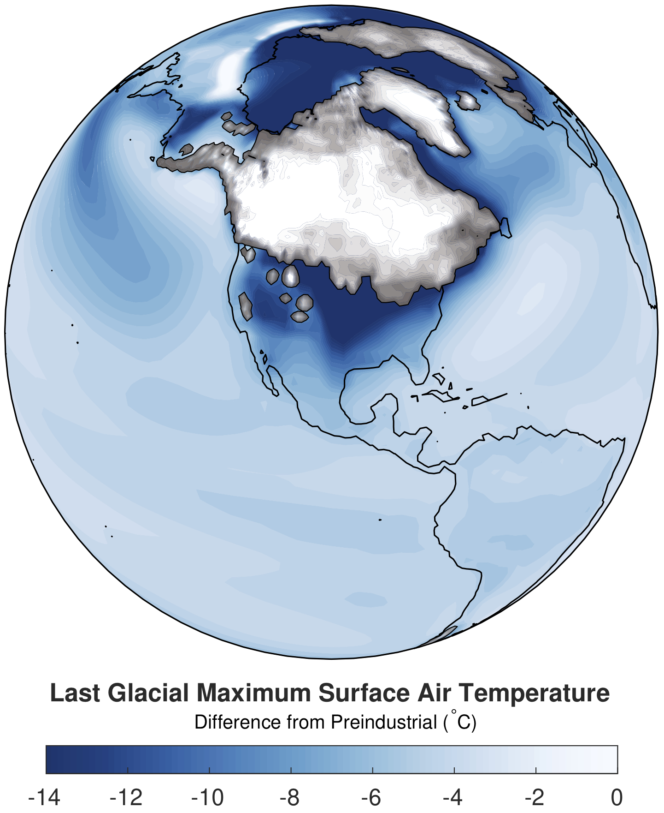

# lgmDA

This is a public repository containing the data used for Last Glacial Maximum (lgm) data assimilation (DA), as well as the results of the assimilation. When using these data or the DA product, please cite the following paper:

Tierney, J.E., Zhu, J., King, J., Malevich, S.B., Hakim, G.J., and Poulsen, C. J. (2020). Glacial cooling and climate sensitivity revisited. Nature (in press).

A preprint of the paper may be found [here](https://doi.org/10.31223/osf.io/me5uj).

## Guide to the files

### The following files contain proxy data only.

These do not have any information from the climate model used for DA and so can be used for other analyses, data-model comparison, etc.

**Tierney2020_LGMProxyData.csv** This contains the raw proxy data values for the LGM timeslice (average values from 23-19 ka) as well as calibrated absolute SSTs (with lower and upper 2-sigma bounds) derived from the Bayesian models BAYSPAR, BAYSPLINE, BAYMAG, and BAYFOX. Site location, foraminifera species, cleaning method (for Mg/Ca) and original data dois are included as well.

**Tierney2020_LHProxyData.csv** As above, but for the Late Holocene timeslice (4-0 ka).

**Tierney2020_ProxyDataPaired.csv** This file contains locations and calibrated SST LGM - LH anomalies (with lower and upper 2-sigma bounds) for all *paired* sites; i.e. sites that are within 0.1 degrees latitude and longitude of one another and contain the same proxy type. Note that anomaly errors are smaller than the absolute errors in the LGM and LH files because the paired data are considered to be dependent. Error here is site-level error (analytical and observational) as opposed to global-level error (error term associated with the global Bayesian calibration models); see the paper for details on how site-level error was assessed. File lists the type of proxy as well as the species, if applicable.

**Tierney2020_ProxyData_5x5_deltaSST.nc** This is a 5 x 5 gridded netCDF file that is derived from the data in **Tierney2020_ProxyDataPaired.csv**. Proxy anomalies within each 5 x 5 gridpoint were averaged, regardless of type. Only gridpoints with proxy locations in them contain data; i.e. no spatial interpolation or extrapolation was applied.

### The following files contain the results from the LGM DA.

These products are a *blend* of proxy and climate model information. The model simulations used for the DA were conducted with the isotope-enabled Community Earth System Model (iCESM). The proxy data were assimilated in native proxy units using an ensemble square root Kalman filter method. Please refer to our paper for details about this process.

When using these products, keep in mind that the structures in the fields are informed by how well CESM simulates large-scale patterns in the ocean and the atmosphere, which could be biased in some regions.

**Tierney2020_DA_atm.nc** This netCDF file contains atmospheric variables, including mean annual surface temperature (SAT) and mean annual &delta;18O of precipitation. The file includes both absolute values for LGM and LH as well as the anomaly fields (variables that begin with *delta*). All values have associated 1-sigma errors (variables that being with *err*) from the ensemble DA results. These data are on a 1.9 (latitude) by 2.5 (longitude) rectangular grid.

**Tierney2020_DA_ocn.nc** This netCDF file contains oceanic variables, including mean annual SST, sea-surface salinity, and &delta;18O of surface seawater. As above, the file includes both absolute and anomaly fields and errors. These data are on a nominal 1 degree Greenland pole grid. Specifically this is the POP ocean model gx1v6 tripolar grid. 

**Tierney2020_DA_ocn_regrid.nc** This netCDF file contains the oceanic variables regridded onto a 1 x 1 degree Cartesian grid. This may be easier to use for plotting.